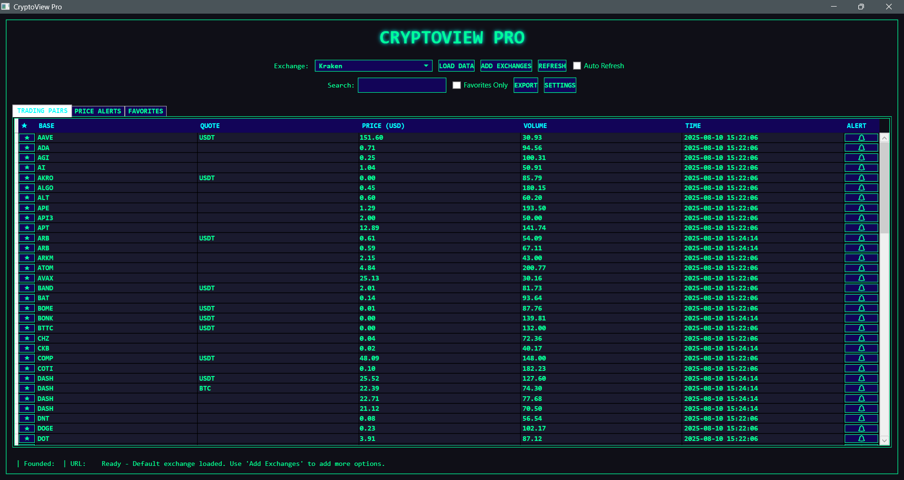

# CryptoView Pro

A comprehensive desktop application built with WPF/.NET that displays cryptocurrency exchange data using the Coinlore API. This enhanced version includes advanced features like price alerts, favorites management, data export, and real-time monitoring capabilities.



## 🚀 Enhanced Features

### Core Functionality
- **Live Exchange Data**: Fetch cryptocurrency exchange information from the Coinlore API
- **Multiple Exchange Support**: View trading pairs from various exchanges with smart filtering
- **Robust Parsing**: Handles multiple API response formats with fallback mechanisms
- **Real-time Updates**: Auto-refresh with configurable intervals and manual refresh options

### Advanced Features
- **🌟 Favorites System**: Mark and manage favorite trading pairs with persistent storage
- **🔔 Price Alerts**: Set custom price alerts with above/below target notifications
- **🔍 Search & Filter**: Real-time search and filtering capabilities
- **📊 Data Export**: Export data to CSV format with timestamped files
- **⏱️ Auto-Refresh**: Configurable automatic data updates every 30 seconds
- **📈 Price Indicators**: Visual price change indicators (▲▼) for trend tracking

### User Interface
- **🎨 Enhanced UI**: Larger window, tabbed interface, and improved cyberpunk styling
- **📑 Multi-Tab Layout**: Organized content in Trading Pairs, Alerts, and Favorites tabs
- **🎯 Smart Controls**: Advanced filtering, sorting, and management controls
- **⚡ Responsive Design**: Async operations keep the UI responsive during data loading

### Data Management
- **💾 SQLite Database**: Local storage for favorites, alerts, and historical data
- **📊 Historical Tracking**: Price history storage for future analytics
- **⚙️ Settings Storage**: Persistent application configuration
- **🔄 Data Persistence**: All user data saved between sessions

## Getting Started

### Prerequisites

- Windows operating system
- .NET 8.0 or later
- Visual Studio 2022 (recommended) or other .NET IDE

### Installation

1. Clone the repository:
   ```
   git clone https://github.com/mars-rift/cryptoview.git
   ```

2. Open the solution file in Visual Studio:
   ```
   cryptoview.sln
   ```

3. Restore NuGet packages:
   ```
   dotnet restore
   ```

4. Build and run the application:
   - Press F5 in Visual Studio, or
   - Use the command line: `dotnet build` followed by `dotnet run`

## 🎯 Usage Guide

### Basic Operations
1. **Initial Setup**: The application automatically loads and filters valid exchanges on startup
2. **Select Exchange**: Choose an exchange from the dropdown menu
3. **Load Data**: Click "LOAD DATA" to fetch trading pairs for the selected exchange
4. **Auto-Refresh**: Enable the auto-refresh checkbox for continuous updates
5. **Search**: Use the search box to filter trading pairs by symbol or name

### Advanced Features
1. **Favorites Management**:
   - Click the ★ button next to any trading pair to add/remove favorites
   - Use "Favorites Only" checkbox to filter the view
   - Access the Favorites tab to manage your watchlist

2. **Price Alerts**:
   - Click the 🔔 button next to any pair to set price alerts
   - Configure above/below target price notifications
   - Manage alerts in the dedicated Alerts tab

3. **Data Export**:
   - Click "EXPORT" to save current data to CSV format
   - Files are automatically timestamped for organization

4. **Settings**:
   - Access application settings via the "SETTINGS" button
   - Configure refresh intervals and other preferences

## 📁 File Structure

### Core Application
- **MainWindow.xaml / MainWindow.xaml.cs**: Enhanced main application UI and logic
- **App.xaml / App.xaml.cs**: Application configuration and startup

### Data Models (`Models/DataModels.cs`)
- **TradingPair**: Enhanced trading pair data with change indicators
- **Exchange**: Basic exchange information
- **ExchangeInfo**: Detailed exchange information including name, founding date, and URL
- **PriceAlert**: Price alert configuration and management
- **HistoricalPrice**: Historical price data for analytics
- **UserSettings**: Application settings and preferences

### Services (`Services/DataService.cs`)
- **DataService**: Comprehensive data persistence layer with SQLite integration

### UI Components (`Windows/`)
- **PriceAlertWindow**: Price alert creation dialog
- **SettingsWindow**: Application settings interface
- **Data Models**:
  - `Exchange`: Basic exchange information
  - `ExchangeInfo`: Detailed exchange information including name, founding date, and URL
  - `TradingPair`: Trading pair data including base/quote currencies, price, volume, and timestamp
  - `ExchangeData`: Container for exchange info and pairs with JSON deserialization support

## 🔧 Technical Details

### Architecture
- **Framework**: WPF with .NET 8.0
- **Database**: SQLite for local data persistence
- **HTTP Client**: Async HttpClient for API requests
- **JSON Parsing**: System.Text.Json with fallback parsing strategies
- **Async/Await**: All network operations are asynchronous for UI responsiveness
- **Error Handling**: Comprehensive try/catch blocks with user feedback
- **Data Binding**: Observable collections for real-time UI updates

### Dependencies
- **OxyPlot.Wpf**: Ready for future charting capabilities
- **System.Data.SQLite**: Local database functionality

### Database Schema
The application uses SQLite to store:
- **HistoricalPrices**: Price history for analytics
- **PriceAlerts**: User-configured price alerts
- **Favorites**: User's favorite trading pairs
- **Settings**: Application preferences and configuration

### Performance Optimizations
- **Smart Filtering**: Only loads exchanges with valid data
- **Caching**: Intelligent data caching to reduce API calls
- **Background Processing**: Non-blocking operations for smooth UI
- **Memory Management**: Proper disposal patterns and resource cleanup

## 🔗 API Usage

The application uses the Coinlore API:
- **Exchange List**: `https://api.coinlore.net/api/exchanges/`
- **Exchange Details**: `https://api.coinlore.net/api/exchange/?id={exchangeId}`

### Rate Limiting
- Built-in delays between API calls to respect rate limits
- Graceful handling of API errors and timeouts
- Automatic retry mechanisms for failed requests

## 🎨 Customization

### Themes
The application features a cyberpunk-inspired theme with:
- **Dark Background**: Professional dark theme (#0F0F17)
- **Neon Accents**: Green (#00FF9C) and cyan (#00FFFF) highlights
- **Custom Controls**: Styled buttons, dropdowns, and data grids
- **Typography**: Consolas font for technical aesthetics

### Extensibility
The modular architecture supports easy addition of:
- Additional exchange APIs
- New alert types and conditions
- Enhanced charting and visualization
- Portfolio tracking features
- Multiple UI themes

## 🔮 Future Roadmap

### Planned Enhancements
1. **📈 Historical Charts**: Interactive price charts with OxyPlot
2. **🔔 Advanced Alerts**: Volume, percentage change, and technical indicators
3. **📊 Portfolio Tracking**: Multi-exchange portfolio management
4. **🌐 Multi-API Support**: Integration with additional crypto APIs
5. **📱 Cross-Platform**: Avalonia UI version for Linux/macOS
6. **☁️ Cloud Sync**: Optional cloud synchronization of user data

### Current Limitations
- Single exchange selection (architecture supports multi-exchange)
- Basic alert system (ready for advanced trigger types)
- Settings panel placeholder (framework implemented)

## 🤝 Contributing

### Development Setup
1. Fork the repository
2. Create your feature branch (`git checkout -b feature/amazing-feature`)
3. Follow the existing code style and patterns
4. Add appropriate unit tests for new features
5. Update documentation as needed
6. Commit your changes (`git commit -m 'Add some amazing feature'`)
7. Push to the branch (`git push origin feature/amazing-feature`)
8. Open a Pull Request

### Code Guidelines
- Use async/await for all I/O operations
- Follow MVVM patterns where applicable
- Implement proper error handling and user feedback
- Add XML documentation for public APIs
- Maintain the existing cyberpunk UI aesthetic

### Testing
- Test with multiple exchanges and data formats
- Verify database operations and data persistence
- Check UI responsiveness during long operations
- Validate error handling with network failures

## License

This project is licensed under the MIT License - see the LICENSE file for details.

## Acknowledgments

- [Coinlore API](https://www.coinlore.com/cryptocurrency-data-api) for providing cryptocurrency exchange data
